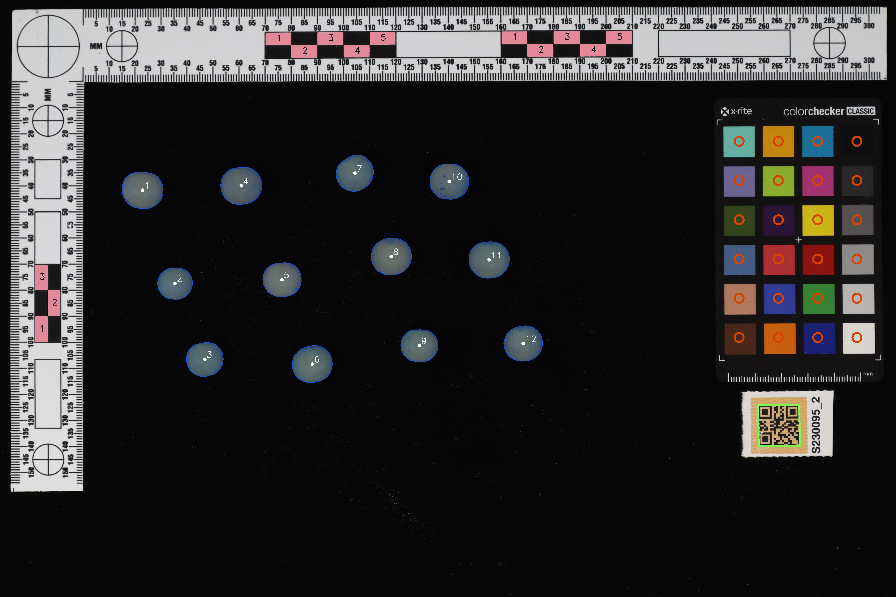

# tomato_cv
Computer vision analysis of fruit quality characteristics in tomato.

This program was designed and developed by Vincent Colantonio, Jillian Belluck, and Anna Hermanns.

This pipeline segments and analyses images of tomato fruit to measure multiple components of fruit quality including size, shape, and color. Input is an image that includes fruit, a qr code, a color checker, and a photomacrographic scale. The fruit are segmented, sample id assigned by qr code, measurements are corrected using the photomacrographic scale, and the color is corrected using the color checker.

